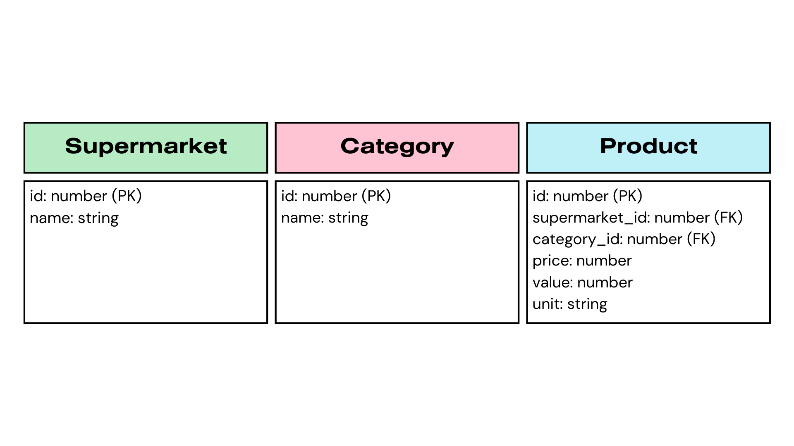

# Market - Backend Project

Backend project based on [Python](https://www.python.org/) 3.11.3 with [FastAPI](https://fastapi.tiangolo.com/) to publish web microservices with CRUD for supermarkets, categories and products.


## 🧰 Installating

Clone the repo
```bash
  git clone https://github.com/AndresOrozcoDev/market_backend_python.git
```

Go to the project directory
```bash
  cd market_backend_python
```

Install virtual environment
```bash
  pip install virtualenv
```

Create virtual environment
```bash
  python -m venv env
```

Activate virtual environment
```bash
  env\Scripts\activate
```

Install requirements.txt file
```bash
  pip install -r requirements.txt
```

Create requirements.txt file
```bash
  pip freeze > requirements.txt
```

Run the project
```bash
  py main.py
```

Run project as server
```bash
  uvicorn main:app --reload
```


## 📞 API Reference

For the consumption of web services an 'api-key' header is required for security.

## Tag Supermarket

#### Get supermarkets

```bash
  GET /api/supermarket/all
```

#### Get supermarket

```bash
  GET /api/supermarket/${id}
```

| Name | Parameter | Type     | Description                       |
| :-------- | :-------- | :------- | :-------------------------------- |
| `id`      | Path      | `int` | **Required**. Id of supermarket to fetch |

#### Post supermarket

```bash
  POST /api/supermarket
```

| Name | Parameter | Type     | Description                       |
| :-------- | :-------- | :------- | :-------------------------------- |
| `name`      | Body      | `string` | **Required**. Name of new supermarket |

#### Put supermarket

```bash
  PUT /api/supermarket/${id}
```

| Name | Parameter | Type     | Description                       |
| :-------- | :-------- | :------- | :-------------------------------- |
| `id`      | Path      | `int` | **Required**. Id of supermarket to fetch |
| `name`      | Body      | `string` | **Required**. Name of update supermarket |

#### Delete supermarket

```bash
  DELETE /api/supermarket/${id}
```

| Name | Parameter | Type     | Description                       |
| :-------- | :-------- | :------- | :-------------------------------- |
| `id`      | Path      | `int` | **Required**. Id of supermarket to fetch |


## Tag Category

#### Get categories

```bash
  GET /api/category/all
```

#### Get category

```bash
  GET /api/category/${id}
```

| Name | Parameter | Type     | Description                       |
| :-------- | :-------- | :------- | :-------------------------------- |
| `id`      | Path      | `int` | **Required**. Id of category to fetch |

#### Post category

```bash
  POST /api/category
```

| Name | Parameter | Type     | Description                       |
| :-------- | :-------- | :------- | :-------------------------------- |
| `name`      | Body      | `string` | **Required**. Name of new category |

#### Put category

```bash
  PUT /api/category/${id}
```

| Name | Parameter | Type     | Description                       |
| :-------- | :-------- | :------- | :-------------------------------- |
| `id`      | Path      | `int` | **Required**. Id of category to fetch |
| `name`      | Body      | `string` | **Required**. Name of update category |

#### Delete category

```bash
  DELETE /api/category/${id}
```

| Name | Parameter | Type     | Description                       |
| :-------- | :-------- | :------- | :-------------------------------- |
| `id`      | Path      | `int` | **Required**. Id of category to fetch |


## 📌 Model




## 🛠️ Testing

For unit tests, [pyTest](https://docs.pytest.org/en/7.3.x/) and [Httpx](https://www.python-httpx.org/) are used, for the execution of said tests, execute the following command

```bash
  pytest
```


## ✍️ Author

- [@AndresOrozcoDev](https://github.com/AndresOrozcoDev)
